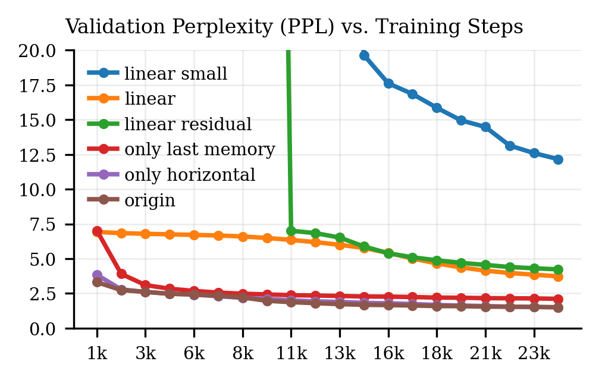

# Ablation Study on M2PTransformer Architecture Design

We perform ablation studies comparing our M2P Transformer against alternative architecture designs to demonstrate the effectiveness of our design.

- Linear small: 2 layer linear layer with hidden size 8192
- Linear: 8 layer linear layer with hidden size 8192, nearly same number of parameters as M2P Transformer
- Linear Residual: Linear with residual connection.
- Only Last Memory: Instead of gathering memory states from all layers, only use last layer output memory states and replicate them across all layers.
- Only Horizontal: M2P Transformer but with 4 token transformer.
- Origin: Origin M2P Transformer with 2 token transformer and 2 layer transformer.

The results shows Transformer architectures generally performance much better than linear(projection) architectures. Using only last layer memory states is worse than using all, demonstrating that aggregrate memory states from all layers is necessary. Origin and Only Horizontal performance similarly in the end, but Origin converges faster in early stage.
