We visualize the relationship between text quality, text length and answer F1-Score. Here we measure text quality by calculating its ppl on Qwen3-8B-Base, a pretrain version of Qwen3-8B

---

Text quality vs. F1-Score

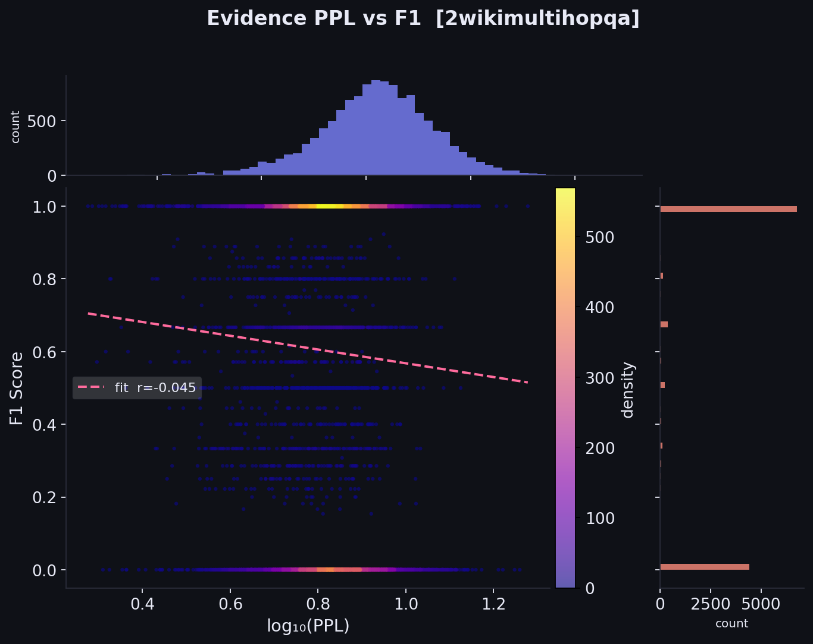
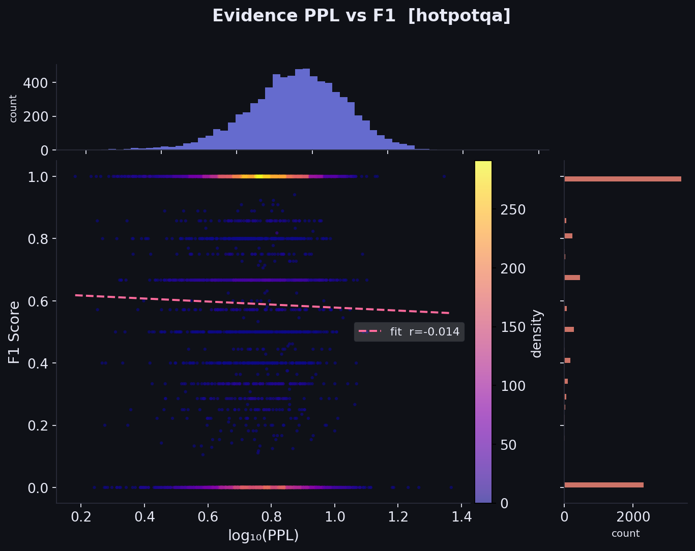
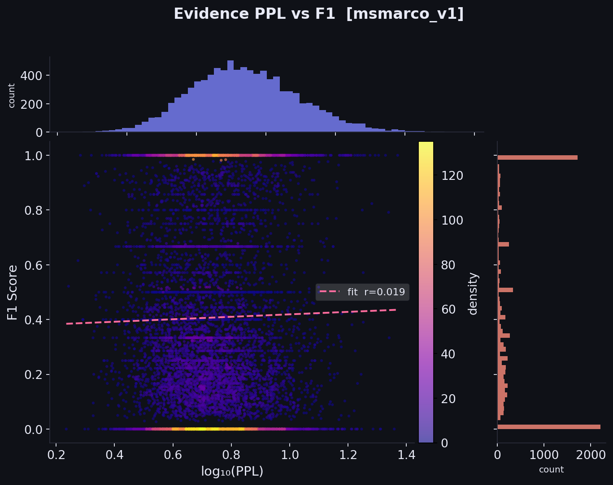
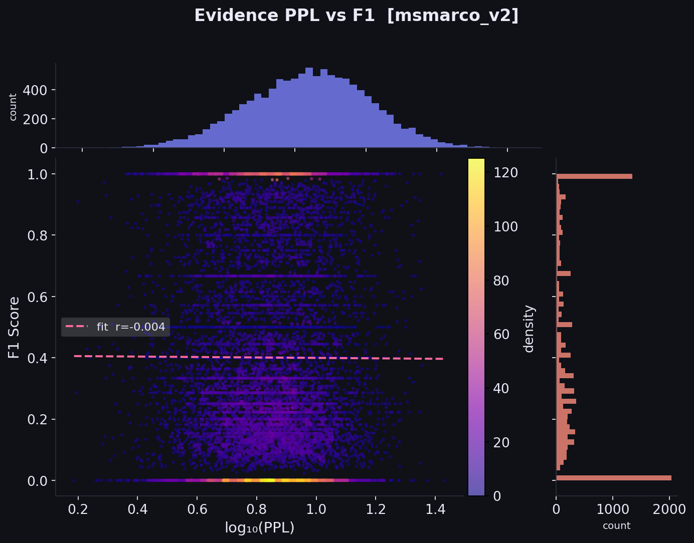
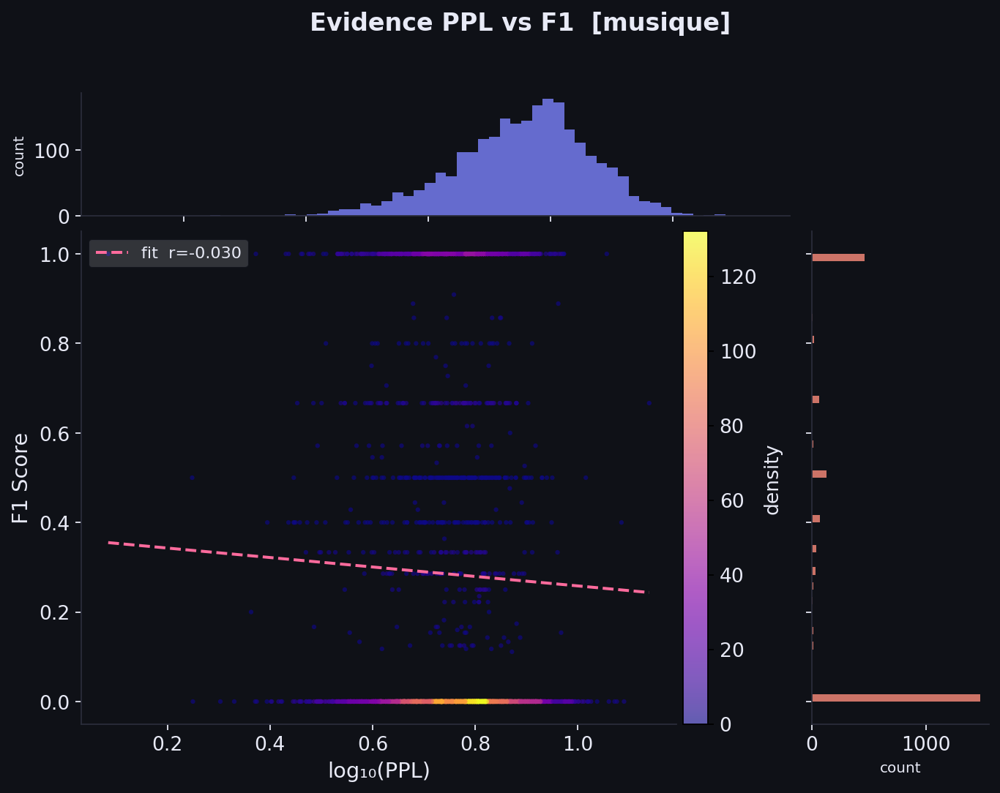
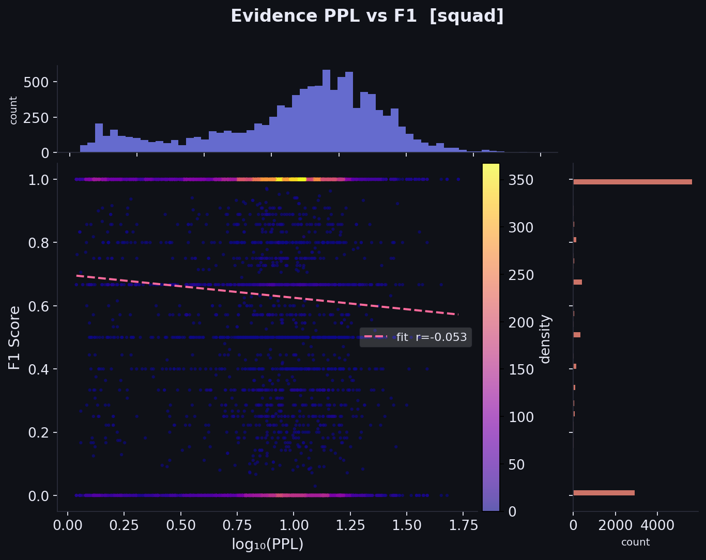

The higher text quality is, the better it can be converted into LoRA.

---

Text length vs. F1-Score

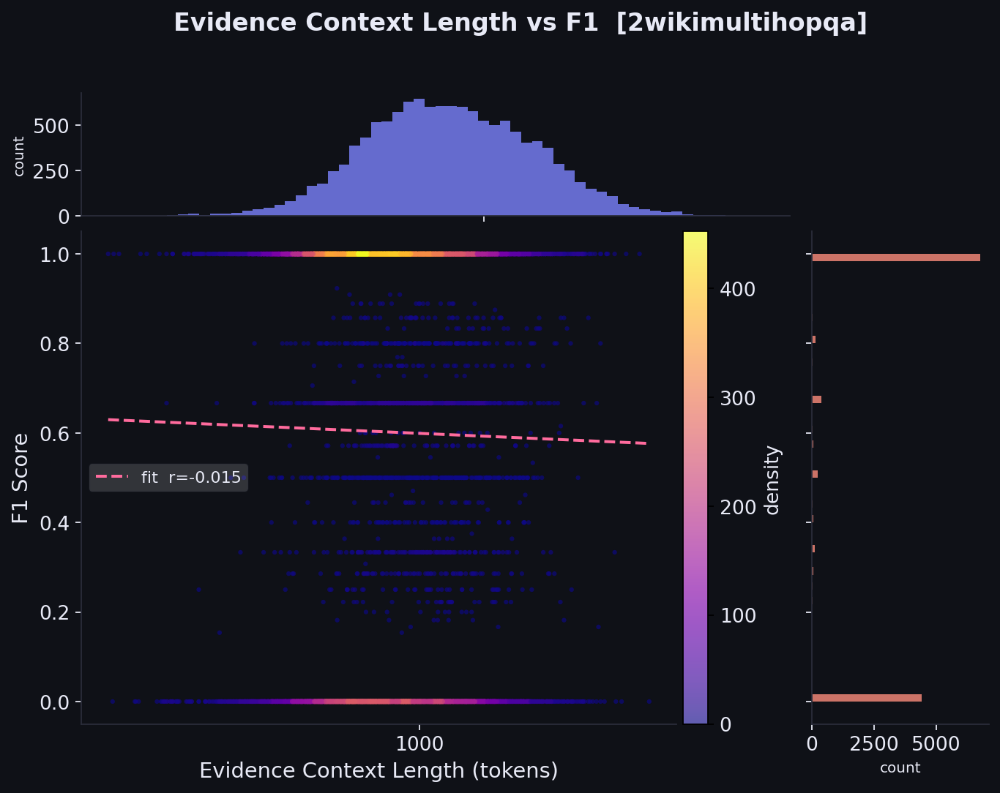
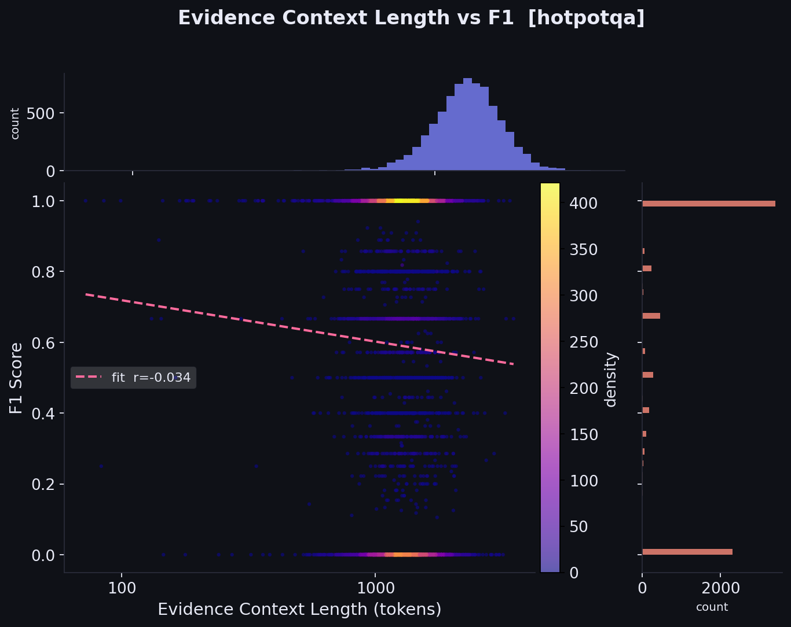
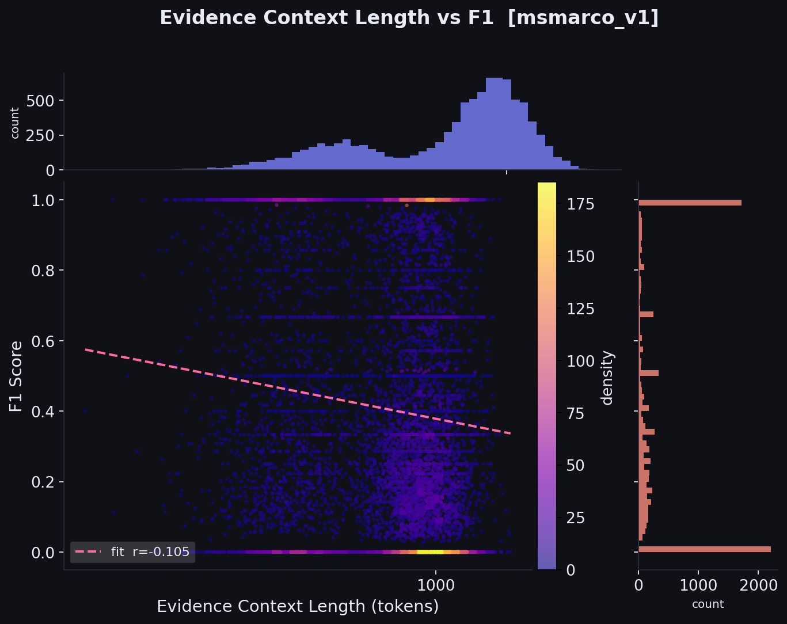
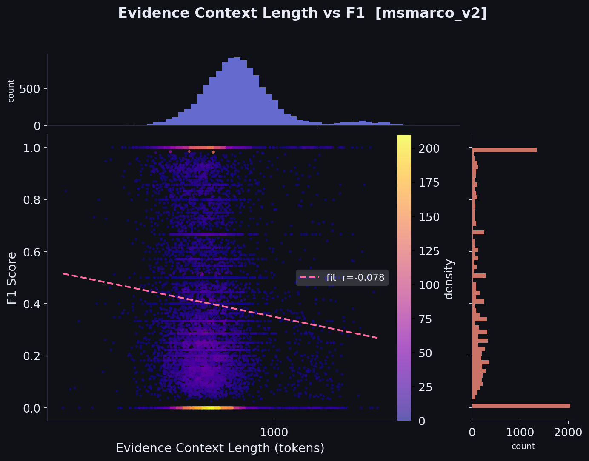
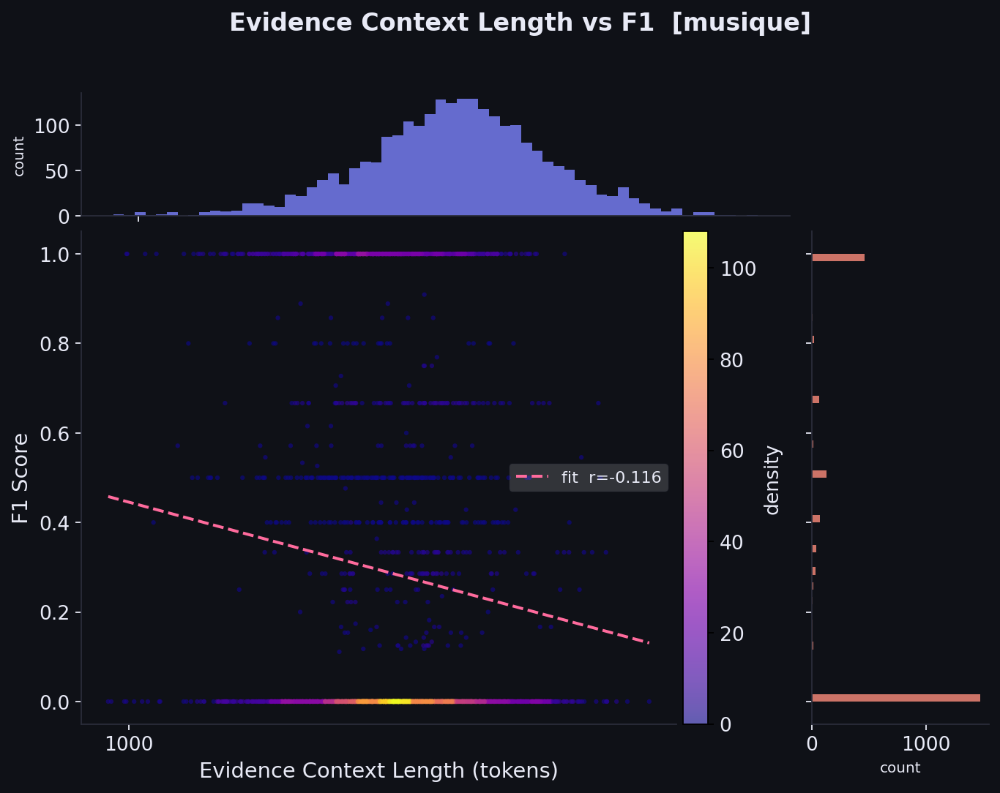
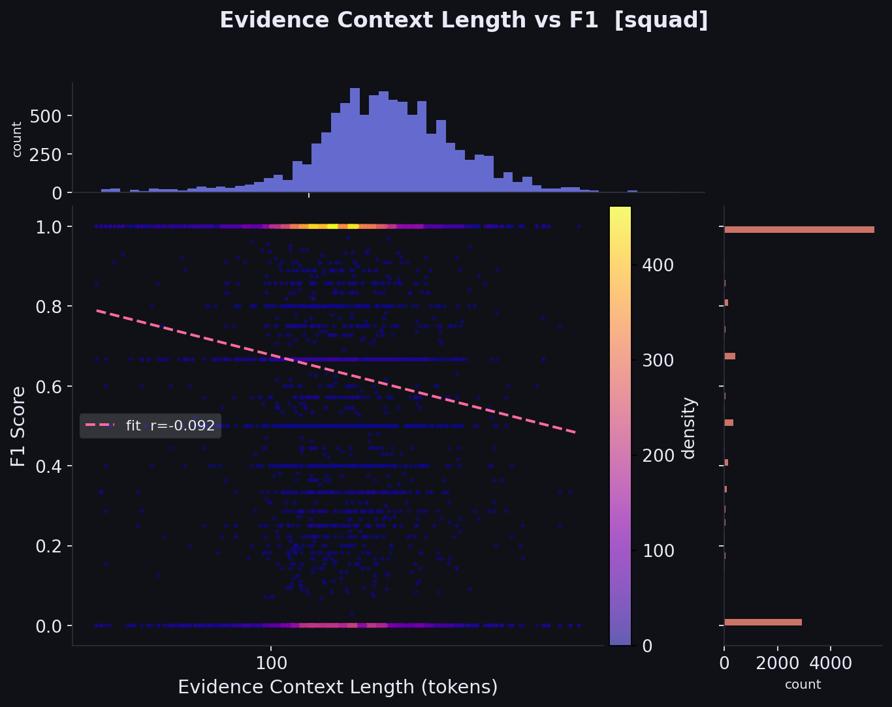

The shorter the text is, the better it can be converted into LoRA.