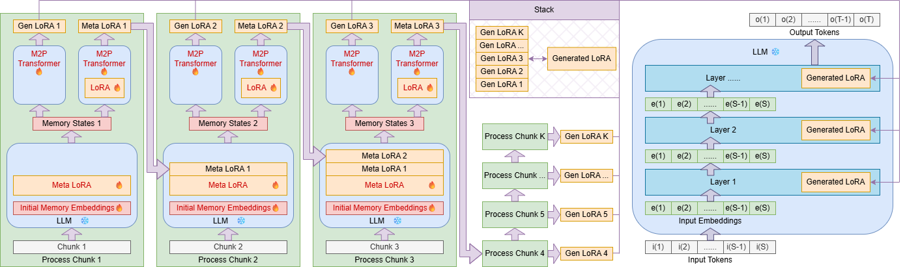
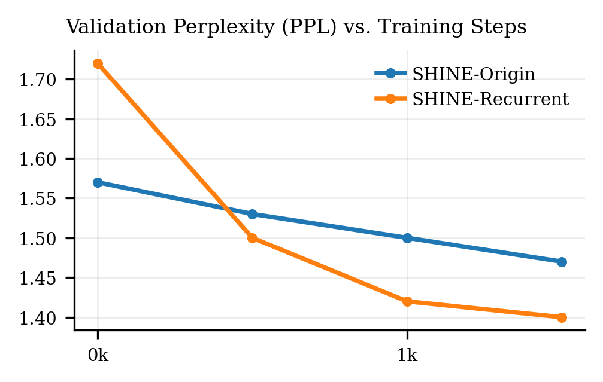

# SHINE Long Context

We extend the architecture of SHINE to long context situation. The way of extending it is flexible. Naively continue pretrain and instruction fine-tune with the same architecture is one solution. Here we introduce a new architecture called SHINE Recurrent, inspiring from the design of RNN. As the picture shows, context is divided into chunks, chunks are passed through LLM to generate memory states. Now M2P Transformer not only convert memory states to lora, but also convert memory states to metalora. The metalora is concatenated back to influence all later generation of memory states.

We reuse the pretrained checkpoint and continue pretrain SHINE on 8k contexts with chunk length 2k tokens. The figure visualize validation ppl in early stage continue pretraining. As it shows, recurrent design performance better during pretrain.

|                  | 2wikimqa(F1) | hotpotqa(F1) | multifieldqa_en(F1) | musique(F1) | qasper(F1) | qmsum(ROUGE) |
|------------------|----------|----------|-----------------|---------|--------|-------|
| in-context       | 45.5     | 55.96    | 49.68           | 31.66   | 42.38  | 22.44 |
| naïve            | 26.68    | 26.96    | 11.74           | 11.62   | 14.02  | 4.76  |
| SHINE(Recurrent) | 33.07    | 32.72    | 21.98           | 14.74   | 20.06  | 19.87 |

We further instruction-tune SHINE-Recurrent with 16k contexts (combined with short contexts) and evaluate it on the LongBench dataset. Specifically, we test it on single-document QA, multi-document QA, and summarization tasks. As shown in the table, SHINE-Recurrent performs effectively in long-context settings. Although there is still a gap compared to in-context learning, the backbone LLM has been extensively trained on in-context tasks with thousands of times more data than ours, making these results already very strong.

In addition, SHINE significantly reduces inference cost. Inference with long contexts takes the same amount of time as without context. In contrast, in-context methods introduce large inference overhead, and due to the long input length, they often cannot run on a single GPU and require frameworks like DeepSpeed to distribute models across multiple GPUs. SHINE does not suffer from these issues at all.
