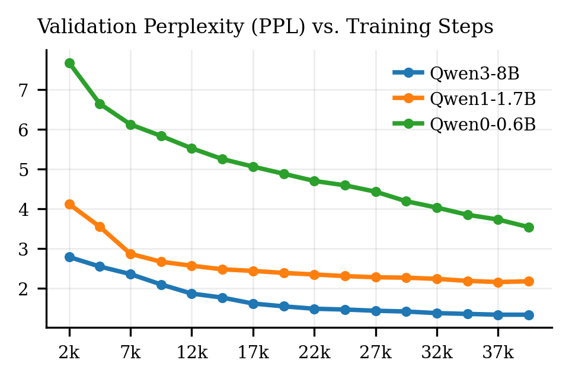
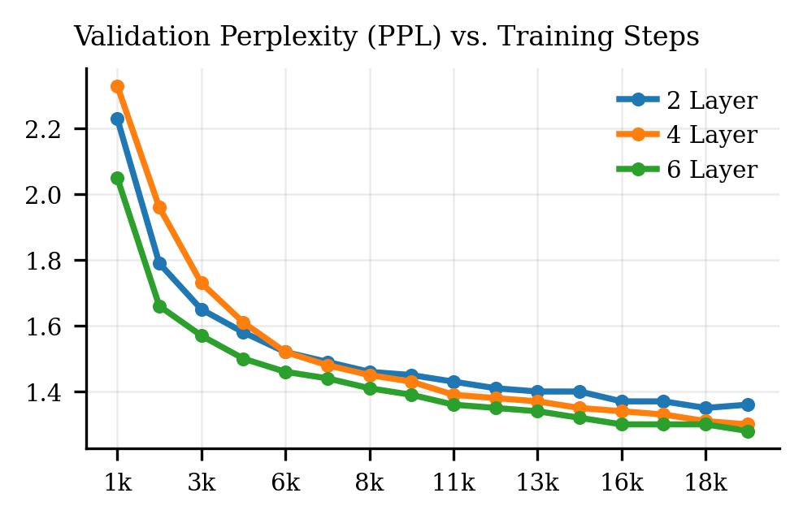
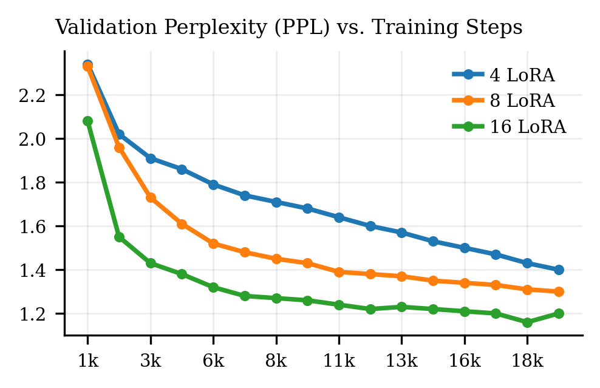

# Scability

This is an picture in our origin paper, with same hypernetwork hyperparameters we use it on Qwen3-0.6B, 1.7B and 8B and find as the backbone LLM becomes stronger, the performance becomes much better, showing that it can scale with the backbone LLM.

During rebuttal we conduct two new researches scaling the layer number and lora rank (memory embedding token number). The default setting is 512 token length pretrain, Qwen3-8B backbone LLM, 4 layer M2P Transformer with metalora rank 128, lora rank 8.

All pictures visualize the validation ppl during pretrain.

We tried 2,4 and 6 layer M2P Transformer, as layer number grows, the results get better.

We evaluated LoRA ranks of 4, 8, and 16. Since memory embedding token number is determined by the LoRA rank, it varies accordingly across settings. As shown, a higher LoRA rank consistently leads to better performance.